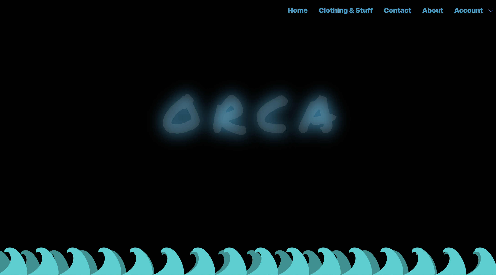
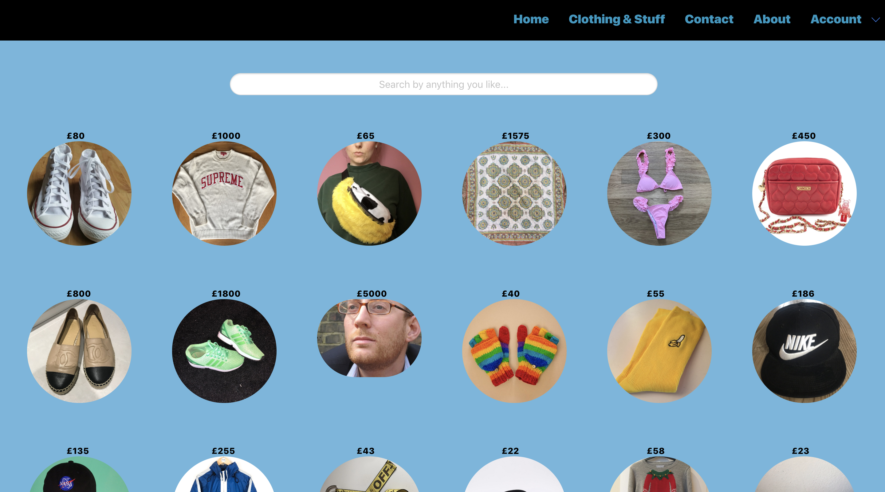
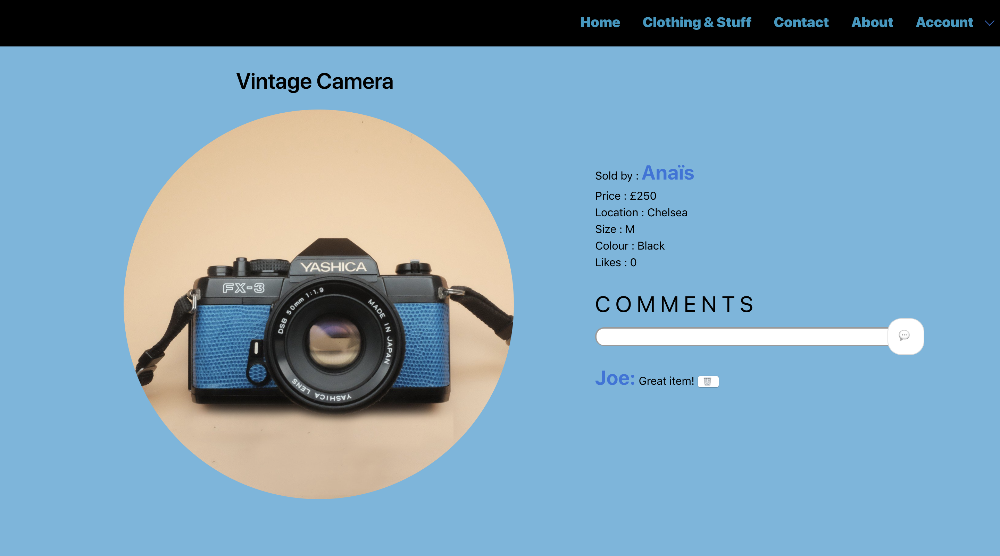
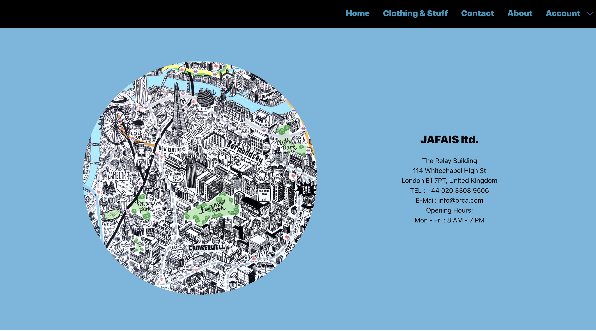
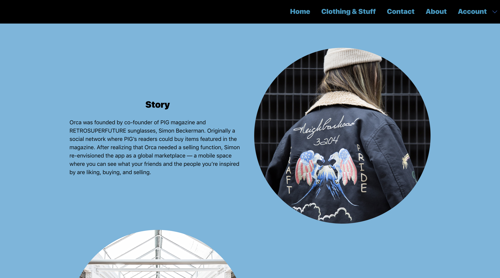
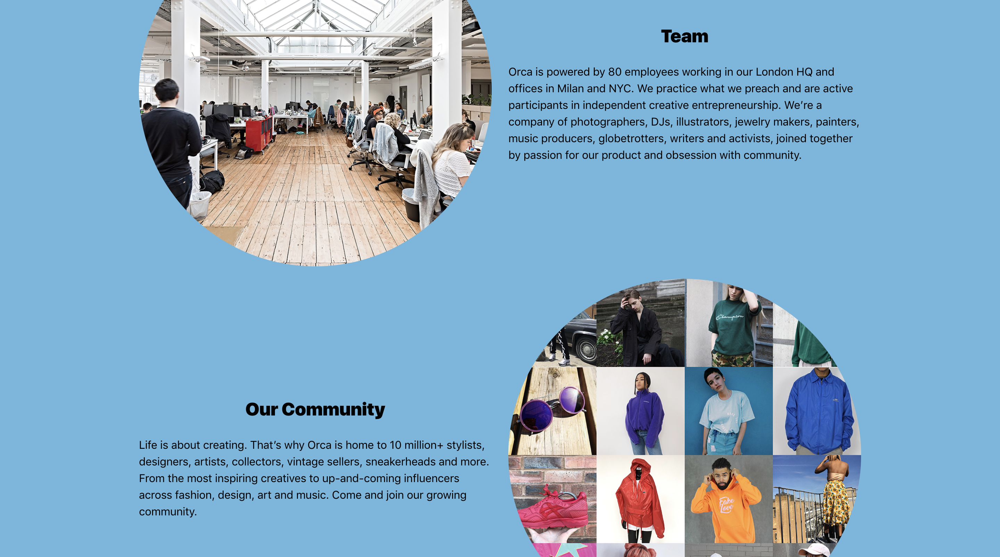
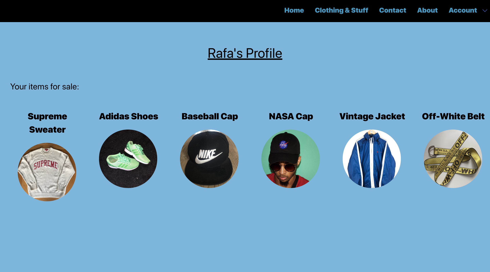
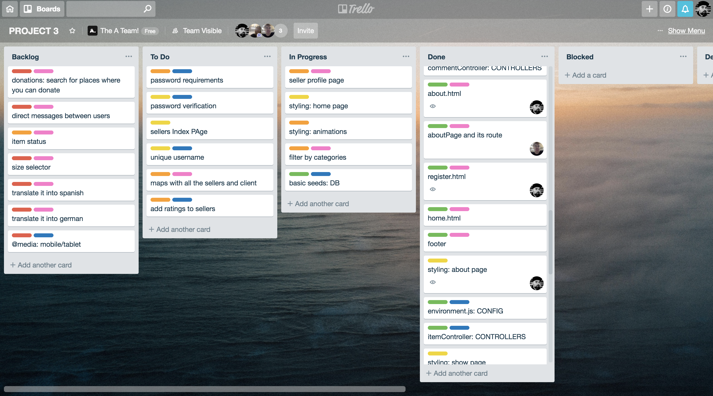

# **WDI Project 3 - Orca** 

# Overview

Orca is a web app that allows users upload their clothing to sell it.

Orca was my third project of the GA Web development course and was also the first time I have worked on a coding project as a group. The timeframe for this project was also one week and the main briefing was to use Angular for the front-end.

Go to [Website](https://project3-orca.herokuapp.com/) and [GitHub](https://github.com/Rafcoding/wdi-project-3).

## Timeframe

1 week (December 2018)

# Brief

* Use Mongo, Node & Express to build a server-side API

* Your API must have at least 2 related models, one of which should be a user

* Your API should include all RESTFUL actions for at least one of those models

* Include authentication to restrict access to appropriate users

* Include at least one referenced or embedded sub-document

* Include automated tests for at least one resource

* Use Angular to build a front-end that consumes your API

* Use SCSS instead of CSS

* Use Webpack & Yarn to manage your dependencies and compile your source code

# Technologies Used

* Angular
* JavaScript (ES6)
* HTML5
* SCSS
* Bulma Framework
* CSS3
* Git
* GitHub
* Bcrypt
* JWT
* Mongoose
* Heroku
* Trello
* Yarn
* Chai
* Mocha

# Aim of the Blog Site

The aim of Orca is to create a community where users can post and sell their clothes, post comments and rate their picks.

A percentage from each transaction is destined to save the Orca.

# Styling and Idea

The idea of creating Orca comes from our love for fashion as well as our care for Orcas.

For the Styling, We picked blue and black as a main colours for the blog site, we decide to have a rounded pattern consistent across the whole project as bubbles, all related to the Sea and Orcas.

# Screenshots

### Intro

### Index

### Show

### Contact

### About

### Profile

# Approach

After a brainstorm in group we decided that we would like to make an app which would be community focussed. After creating some initial wireframes we mapped out our project using Trello.

We decided to work together on the backend of the app before we moved onto the front end. We also identified what features where part of our MVP (Minimum Viable Product) and which would be nice to have but not essential.

We broke the development process down into sprints. During each sprint, we focussed on small, specific parts of the project. After completing each sprint, we evaluated our work and discussed our goals for the next sprint, before continuing the process.

# Wins and Blockers

This was the first time in the course that we had worked on a project in a group. As such a lot of our challenges came from differences in naming conventions and in working out how to evenly split the workload. Filtering by distance involved reading a lot of documentation online but I was really pleased that we managed to include the feature.

It was a great experience overall.

# Future Content

There are a number of potential future features I could implement, such as:

* A map where people can pin their locations.
* A section where users can bid on clothes.
* Prive messages services between the users.
